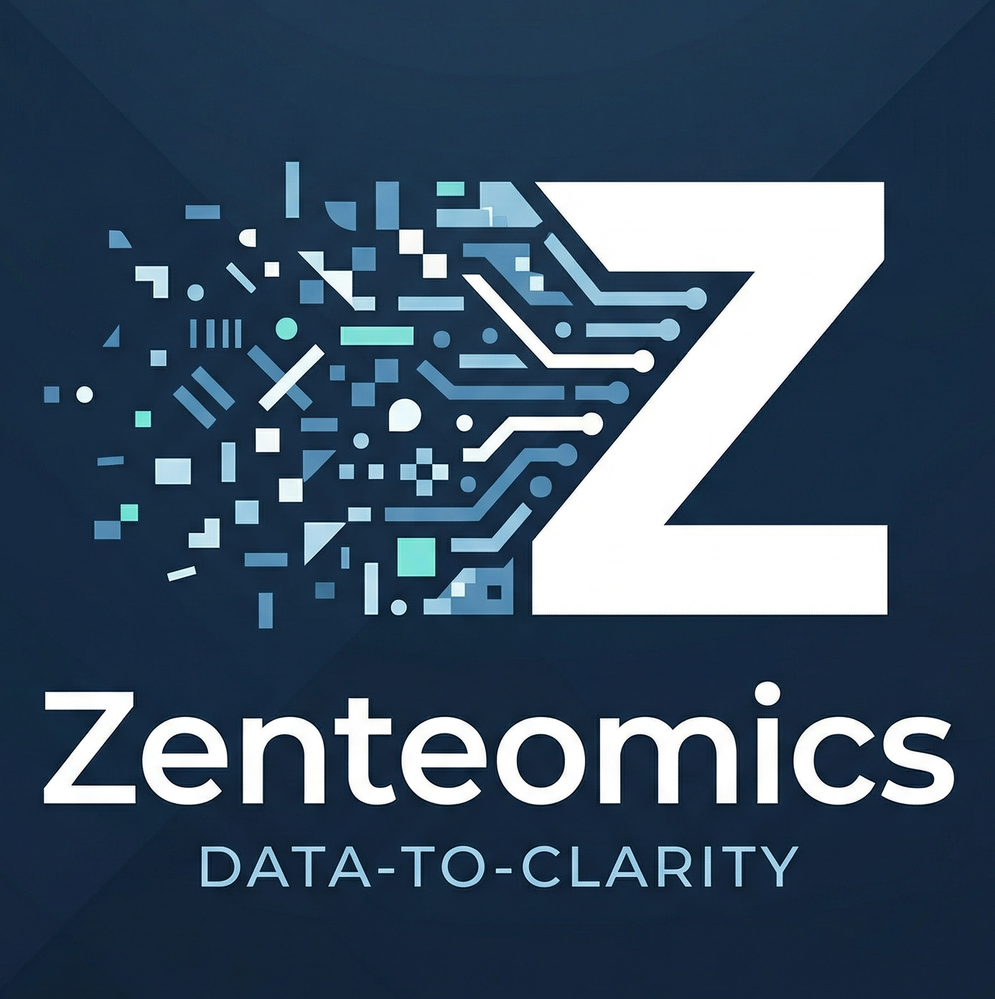

<!-- markdownlint-disable MD033 MD036 MD041 -->

&nbsp;
&nbsp;

Computational proteomics. Rigorous analysis, inspectable outputs, honest QC.

---

Zenteomics is a one-person computational proteomics practice. I'm Enes K. Ergin, the computational biologist behind it, based in Vancouver, BC. I help research groups get results they can defend: cleaner analysis, stronger QC, outputs that stay inspectable from raw data to final figure. When you hire Zenteomics, the person who scopes your project is the person who does the work.

---

## What I do

- **Analysis support.** Downstream analysis and interpretation for studies with data and a defined question.
- **QC and reproducibility review.** Independent audit of an existing dataset or pipeline.
- **Statistical rescue.** Re-analysis when methods or assumptions look weak.
- **Workflow cleanup.** Restructure an analysis workflow for reproducibility and documentation.

More detail on the [services page](https://zenteomics.com/services).

**Good fit:** real proteomics data with a concrete question, outputs you are not confident defending, a deadline that needs results that hold up. **Not a fit:** wet-lab work, clinical advice, generic software development.

---

## Tools and community

Every public tool here started as internal machinery built for repeated analysis problems. Repositories go public when they are stable, documented, and useful beyond one project.

The first community project is **awesome-proteomics**: a curated list of tools, resources, and knowledge for MS-based proteomics, with practical guides and start-to-finish workflows. It goes public when ready.

Core stack:

---

## How I work

<table>
<tr>
<td width="25%" align="center" valign="top">

**Explicit** **assumptions**

Every analytical choice is documented. Nothing buried.

</td>
<td width="25%" align="center" valign="top">

**Inspectable** **outputs**

Readable, reproducible, auditable. No black boxes.

</td>
<td width="25%" align="center" valign="top">

**Scoped** **work**

I define inputs, outputs, and boundaries before work starts.

</td>
<td width="25%" align="center" valign="top">

**Stated** **limits**

Every deliverable says what the data cannot support.

</td>
</tr>
</table>

---

Working on a proteomics dataset and not confident in the results? Describe your data, your question, and your timeline. No forms, just email.

&nbsp;

